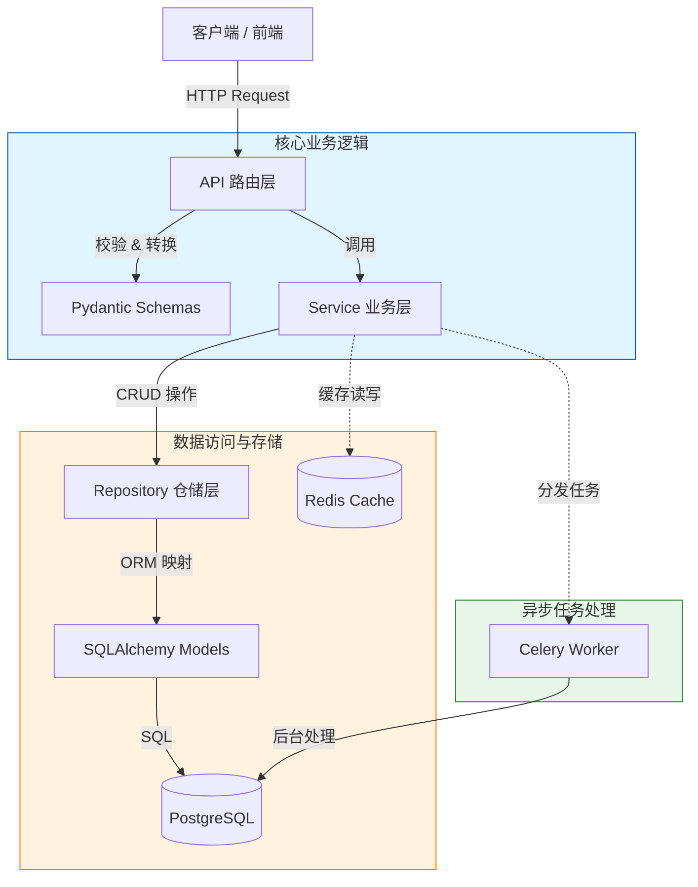

# YiDao 易道 — 后端

<div align="center">

[](https://www.python.org/downloads/)
[](https://fastapi.tiangolo.com)
[](https://docs.pydantic.dev)
[](https://www.sqlalchemy.org/)
[](https://github.com/astral-sh/ruff)
[](https://www.docker.com/)

<h1>YiDao 易道 — 对话式生活分析与教练助手</h1>

<p>
  <strong>FastAPI + PostgreSQL + Redis + Celery + LangGraph</strong>
</p>
<p>
  项目根目录 <a href="../README.md">README</a> · 怎么跑见 <a href="../RUN.md">RUN.md</a>
</p>

</div>

---

## ✨ 核心特性

- ⚡ **极致性能**：基于 **FastAPI** + **Uvloop**，全链路异步设计，性能接近 Go/Node.js。
- 🧱 **坚实架构**：采用 **分层架构** (Router -> Service -> Repository)，职责分离，易于维护和扩展。
- 🗄️ **现代数据层**：集成 **SQLAlchemy 2.0** + **Alembic**，支持异步数据库操作和版本迁移。
- �️ **类型安全**：全面使用 **Pydantic v2** 进行数据校验和序列化，IDE 自动补全支持极佳。
- 🧩 **任务队列**：内置 **Celery** + **Redis**，轻松处理邮件发送、报表生成等耗时任务。
- 🐳 **容器化**：提供生产级 **Docker** 配置，支持多环境（Dev/QA/Prod）一键部署。
- � **可观测性**：集成 **Prometheus** 监控指标和 **OpenTelemetry** 链路追踪。
- ✅ **代码质量**：预置 **Ruff** (Linter), **Black** (Formatter), **MyPy** (Type Check) 和 **Pytest**。

## 🏗️ 系统架构

本项目采用经典的分层架构设计，确保代码的高内聚低耦合。



### 🛡️ 统一错误处理

项目实现了**全自动化、类型安全**的错误处理机制。所有异常（即使是未捕获的 500）都会被统一转换为标准 JSON 格式：

```json
{
  "success": false,
  "error_code": "USER_NOT_FOUND",
  "message": "User with ID 123 not found",
  "details": null
}
```

- **类型安全**: 基于 Pydantic 响应模型，Schema 定义即文档。
- **自动拦截**: 涵盖业务异常、Pydantic 校验错误、HTTP 异常和系统崩溃。
- **前端友好**: 无论请求成功与否，响应结构始终保持一致。

---

## � 快速开始

### 前置要求

*   **Docker Desktop** (推荐) 或 PostgreSQL + Redis
*   **Python 3.12+** (如果本地运行)
*   **uv** (推荐) 或 pip

### 方式一：Docker 一键启动 (推荐)

最快体验项目的方式，无需配置本地 Python 环境。

```bash
# 1. 进入后端目录（从仓库根）
cd backend

# 2. 配置环境变量
cp .env.example .env

# 3. 启动服务 (自动下载镜像并构建)
docker compose up -d

# 4. 查看状态
docker compose ps
```

🎉 **访问地址：**
*   API 文档: http://localhost:9000/docs
*   ReDoc: http://localhost:9000/redoc
*   Grafana: http://localhost:3000 (默认: admin/admin，需单独起 monitoring)
*   Jaeger: http://localhost:16686 (需单独起 monitoring)

### 方式二：本地开发模式

适合需要频繁修改代码的开发场景。

```bash
# 1. 安装依赖 (使用 uv 加速)
uv sync --extra dev

# 2. 启动基础服务 (DB & Redis)
docker compose up -d db redis

# 3. 修改 .env (确保 DB_HOST=localhost)
# Win/Linux:
sed -i 's/DB_HOST=db/DB_HOST=localhost/g' .env

# 4. 运行应用
uv run python main.py
```

---

## � 项目结构

```text
backend/
├── app/                        # 🎯 应用核心代码
│   ├── api/                    # 路由层：处理 HTTP 请求
│   ├── core/                   # 核心配置：Config, Security, Logging
│   ├── exceptions/             # 异常处理：自定义异常与处理器
│   ├── middlewares/            # 中间件：审计、监控、CORS
│   ├── models/                 # 模型层：SQLAlchemy ORM 定义
│   ├── repository/             # 仓储层：数据库 CRUD 封装
│   ├── schemas/                # 模式层：Pydantic 数据校验与响应定义
│   ├── services/               # 业务层：复杂业务逻辑
│   ├── utils/                  # 工具类
│   ├── dependencies.py         # 依赖注入：数据库、缓存、Service
│   ├── tasks.py                # Celery 异步任务定义
│   └── main.py                 # 程序入口
├── migrations/                 # 🗃️ 数据库迁移脚本 (Alembic)
├── scripts/                    # 🛠️ 实用运维脚本 (PowerShell)
├── tests/                      # 🧪 测试用例
├── docker-compose.yml          # 开发环境编排
└── pyproject.toml              # 项目依赖配置
```

---

## � 配置与环境

项目主要通过环境变量进行配置。

<details>
<summary><strong>展开查看常用环境变量 (.env)</strong></summary>

| 变量名        | 说明         | 默认值                              |
| ------------- | ------------ | ----------------------------------- |
| `APP_ENV`     | 运行环境     | `development`                       |
| `DB_HOST`     | 数据库主机   | `db` (Docker) / `localhost` (Local) |
| `DB_PORT`     | 数据库端口   | `54320`                             |
| `DB_USER`     | 数据库用户   | `postgres`                          |
| `DB_PASSWORD` | 数据库密码   | `postgres`                          |
| `Redis_HOST`  | Redis 主机   | `redis`                             |
| `SECRET_KEY`  | JWT 签名密钥 | **请务必修改**                      |

</details>

### 多环境部署

项目支持多环境配置，通过不同的 docker-compose 文件管理：

| 环境     | 命令 (PowerShell)           | 配置文件                  | 说明                    |
| -------- | --------------------------- | ------------------------- | ----------------------- |
| **Dev**  | `.\scripts\docker-dev.ps1`  | `docker-compose-dev.yml`  | 开启热重载，Debug 模式  |
| **QA**   | `.\scripts\docker-qa.ps1`   | `docker-compose-qa.yml`   | 模拟生产，2 Workers     |
| **Prod** | `.\scripts\docker-prod.ps1` | `docker-compose-prod.yml` | 性能优化，Gunicorn 管理 |

### 💻 VS Code 开发者体验

本项目深度集成了 **VS Code Tasks**，提供即开即用的开发体验。

按下 `Ctrl+Shift+B` (或 `Ctrl+Shift+P` -> `Tasks: Run Task`) 即可访问以下任务：

*   **Dev: Start**: 一键启动/重启开发环境。
*   **Logs: Select Service**: 交互式查看任意服务 (Web, DB, Redis, Prometheus, Jaeger...) 的实时日志。
*   **Monitoring: Start/Stop**: 独立控制监控堆栈 (Prometheus, Grafana, Jaeger) 的启停。
*   **Docker: Clean All**: 一键重置环境（慎用）。

> 💡 **提示**：所有任务底层均调用 `scripts/` 下的 PowerShell 脚本，确保了 IDE 与命令行操作的一致性。

---

## 🗃️ 数据库迁移 (Alembic)

我们使用 Alembic 管理数据库版本。**不要手动修改数据库表结构**，请始终使用迁移脚本。

**常用命令：**

```bash
# 1. 生成迁移脚本 (在修改 models 后执行)
uv run alembic revision --autogenerate -m "描述你的变更"

# 2. 应用迁移 (更新数据库)
uv run alembic upgrade head

# 3. 回滚一次迁移
uv run alembic downgrade -1
```

> **注意**：在 Docker 环境中，可以进入容器执行上述命令，或利用 `scripts/` 下的辅助工具。

---

## 📊 监控与可观测性 (Monitoring)

项目预配置了完整的监控堆栈，基于 **Prometheus** 和 **Grafana**，可实时监控应用性能和资源状态。

### 启动监控

监控服务作为可选组件提供。由于占用一定资源，默认不随主应用启动。

```bash
# 启动应用基础服务 + 监控堆栈
docker compose -f docker-compose.yml -f docker-compose-monitoring.yml up -d
```

### 服务仪表盘

| 服务组件       | 访问地址               | 默认凭证          | 用途                                              |
| -------------- | ---------------------- | ----------------- | ------------------------------------------------- |
| **Grafana**    | http://localhost:3000  | `admin` / `admin` | **可视化看板**：预置了 API 性能、系统资源等仪表盘 |
| **Prometheus** | http://localhost:9090  | (无)              | **指标收集**：查询原始指标数据                    |
| **Jaeger**     | http://localhost:16686 | (无)              | **链路追踪**：查看请求在各组件间的调用链路        |

### 关键监控指标

*   **API 性能**: 请求吞吐量 (RPS)、响应延迟 (Latency P99/P95)、HTTP 错误率。
*   **基础设施**: CPU/内存使用率、磁盘 I/O、网络流量。
*   **中间件状态**:
    *   **PostgreSQL**: 活跃连接数、每秒事务数。
    *   **Redis**: 缓存命中率、内存碎片率。
    *   **Celery**: 队列积压任务数、Worker 在线状态。

### 🔗 链路追踪 (OpenTelemetry)

项目通过 OpenTelemetry 实现了全链路追踪，支持从 API 入口到关联的异步任务：

*   **自动插桩**: 自动追踪 FastAPI 请求、SQLAlchemy 查询、Redis 操作以及 Celery 任务。
*   **上下文传播**: Trace ID 会从 API 请求自动传递到关联的 Celery 后台任务，在 Jaeger 中可见完整瀑布流。
*   **调试友好**: 响应头包含 `X-Trace-ID`，方便根据日志快速定位链路。

---

## 🧪 测试与质量

保持高质量代码是本项目的核心原则。

```bash
# 运行单元测试
uv run pytest

# 生成覆盖率报告
uv run pytest --cov=app --cov-report=html

# 代码格式化与检查
uv run ruff check app tests
uv run black app tests
uv run mypy app
```

### CI/CD 流水线

项目集成了 GitHub Actions，包含以下工作流：
1.  **Code Quality**: 自动运行 Ruff, Black, MyPy。
2.  **Test**: 运行 Pytest 并上传覆盖率。
3.  **Build**: 构建 Docker 镜像并推送。

## 📄 许可证

本项目基于 [MIT 许可证](LICENSE) 开源。
